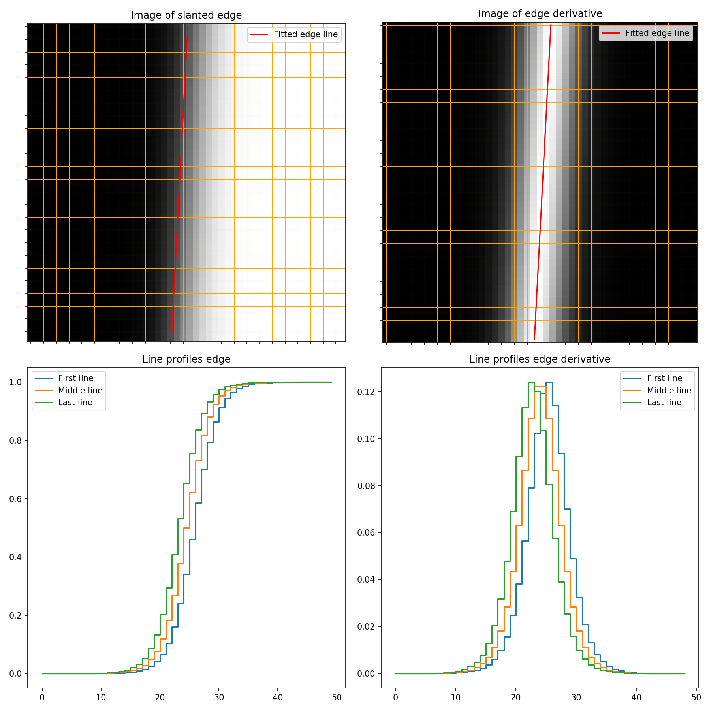

# Principles
## The slanted edge
The Gd edge sample is used to measure the resolution based on the edge spread function. As you will see the edge is mounted slightly rotated. This is on purpose to allow sub pixel sampling of the edge shape. This is done by fitting a straight line to the image edge. This line is used to sample the edge profile over several lines and it can be done with sub pixel resolution. 
(Picture: Weerawat Pornnroongruengchok) 
The plots below show an example of a slanted edge image and the edge profile plots from it. 

## Measuring the collimation ratio

# 2D Edge analysis tool
There is some math and coding involved in performing this analysis. Therefore, we are developing a tool that helps you doing the analysis of you images.

