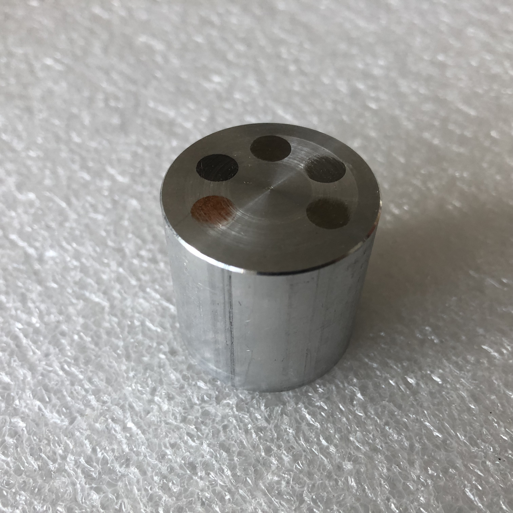

# Experiment descriptions

## The sample box
 

## The Contrast sample
The contrast sample from the previous iteration of the project (Kaestner, et al., 2013) has been updated by replacing the PE inset with an inset of Ti. This was done to reduce the effect of starvation streaks that appears in particular for combinations of the high attenuation insets. The contrast sample is intended verify the ability to quantitatively determine the attenuation coefficients for five materials using computed tomography.
The experiment requires the acquisition of a CT projection data set and the following reconstruction to provide the data required for the analysis.  
 

### Experiment workflow
1.	Place the contrast test object on the sample table. Best results are obtained if the object is placed eccentric to the acquisition axis. The reason is that ring cleaning algorithms are sensitive to round shapes and would try to correct the sample edges.
2.	Perform the CT scan as described in [How to perform a CT experiment](CTExperimentDescription).
3.	Reconstruct the projection data to a volume data set. Make a note of which attenuation coefficient interval was used for the mapping to 16-bit unsigned data format.

### Expected experiment duration
This is CT experiment that requires many projections and the exposure time per projection depends on the pixel size. Some examples based on a 2k x 2k detector would be 625 projections with between 1s and 60s exposure time each. This would result in an experiment time of between 1.5h and 12h including setup. Most of this time doesn't require staff presence.

## Determine the resolution from a radiograph 
The concept of determining the resolution from an edge is in general described in standard documents like ISO 12233 and textbooks (Burke, 1996). For neutron imaging the highest contrast is obtained using gadolinium. The edge device shown in figure 1 has two edges to measure the resolution horizontally and vertically. The frame makes it easy to place the test object on the sample table.

 

Edge device to determine the edge unsharpness of the imaging system.

### Experiment workflow
1.	Place the edge device on top of a horizontal support and as close to the detector as possible to minimize the impact of the geometric unsharpness.
2.	Make a radiograph of the sample with high utilization of the dynamic range of the camera (for a 16-bit camera at least 30000 gray levels but avoid detector saturation).
3.	Make reference images for flat field and dark current.

### Expected experiment duration
This experiment requires three radiographs as a minimum. This would take about 15 minutes to obtain. It is however recommended to make multiple radiographs for each type of image. The total time would be about 1h, staff is required during this time.

## Using the edge object to estimate L/D
The impact of geometric unsharpness is explored by moving the edge device away from the detector. There are two main components in the unsharpness; 1) detector unsharpness and 2) geometric unsharpness. The detector unsharpness is dominant for images acquired with the sample close to the detector, while the geometric unsharpness dominates for samples remotely from the detector. It is possible to measure the impact of geometric unsharpness by moving the edge device away from the detector and making radiographs on each position. 

 

### Experiment workflow
1.	Place the edge object at the positions 2, 10, 20, 40, 80, 160, 240, 320 mm away from the detector. Acquire well exposed radiographs on each position. This procedure should deliver images similar to the ones in figure 2.
2.	Name each image file with the device distance. 
3.	Make reference images for flat field and dark current using the same exposure time as for the edge images.

### Expected experiment duration
This experiment requires as a minimum one radiograph per distance and reference images for flat field and dark current. The total time would be about 2h depending on how fast the sample positioning can be done, staff is required throughout this experiment.

##	Large ball for MTF in CT
The resolution of a CT image is more complicated to determine than for the radiographs. First, a complete CT scan must be performed. Second, the material of the test object must allow some neutrons to penetrate the object, otherwise it will not be possible to reconstruct the projections into a valid volume. Also, CT provides volume information, therefore we also need to measure the resolution outside the plane of the central slice. The best shape for this is the sphere. We chose to use a 20 mm copper ball as test object as the curvature is sufficiently low to locally approximate the surface as flat for the edge extraction. 

 

### Experiment Workflow
1.	Place the copper ball on the sample table. Best results are obtained if the ball is placed eccentric to the acquisition axis. The reason is that ring cleaning algorithms are sensitive to round shapes and would try to correct the sample edges.
2.	Perform the CT scan as described in [How to perform a CT experiment](CTExperimentDescription)
3.	Reconstruct the projection data to a volume data set. Make a note of which attenuation coefficient interval was used for the mapping to 16-bit unsigned data format. Also note the pixel size.

### Expected experiment duration
This is CT experiment that requires many projections and the exposure time per projection depends on the pixel size. Some examples based on a 2k x 2k detector would be 625 projections with between 1s and 60s exposure time each. This would result in an experiment time of between 1.5h and 12h including setup. Most of this time doesn't require staff presence.

## Packings of small ball for CT resolution measurements
A three-dimensional analogue to line pair test devices for radiography is to use a set of vials filled with small balls. Each vial is filled with single diameter balls. The resulting packing contains voids and highly attenuating material (we have chosen to use copper). The four vials in the sample box are filled with ball diameters 0.5, 0.8, 1.0, and 2.0 mm. By dividing the ball diameter by the pixel size, you will be able to tell how well the spheres will be represented at the current resolution. In general, you should aim for spheres with diameters greater than ten pixels, figure 3. With smaller spheres the system blurring will smooth the pore space making it hard to uniquely identify the edges.

 

The sphere material copper has an attenuation coefficient of 1.07 1/cm for thermal neutrons. This allows to arrange the samples as in figure 4, or piled on top of each other. This resolution sample is relatively small. Therefore, you can even include it in your experiments to provide a resolution reference in your experiment data. The arrangement of the vials has an impact on the number of projections as a single vial is less wide than all four at once.

### Experiment workflow
1.	Arrange the samples a shown in figure 4.
2.	Perform a CT scan as described in [How to perform a CT experiment](CTExperimentDescription)
3.	Reconstruct the data using the reconstruction tool of your choice. Pay special attention to finding the correct center of rotation and axis tilt as even small deviations will affect the resolution.
4.	Save the reconstructed slices and the used pixel size for analysis.

### Expected experiment duration
This is CT experiment that requires many projections and the exposure time per projection depends on the pixel size. Some examples based on a 2k x 2k detector would be 625 projections with between 1s and 60s exposure time each. This would result in an experiment time of between 1.5h and 12h including setup. Most of this time doesn't require staff presence.

## Total experiment duration
All experiments should be possible to complete within two days of beam. For weaker neutron sources this may be longer.
