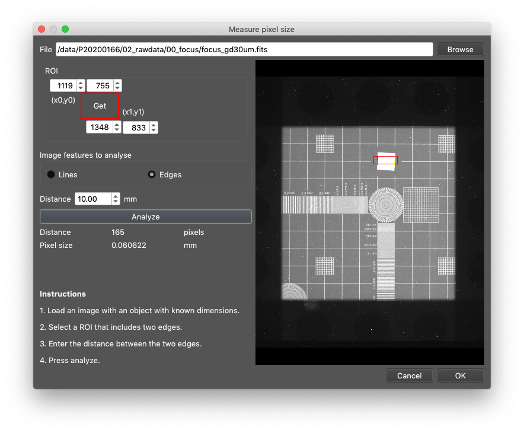

# Measure pixel size from known objekts
The pixel size varies with the current setup and must be measured from the images. Typically, this is done by measuring the distance between two points in with a known metric distance. 
The pixel size is then defined as 

This procdedure is often done using for example ImageJ.

## Pixel size measurement wizard
In our tools we provide a wizard to measure the pixel size from images. In the wizard 
1. you open an image with good reference features, i.e. items with parallel straight edges with known distance between the edges. E.g. the Slanted edge test ofject object or a resolution test pattern.
2. Select a ROI which generously encloses the two edges (or lines). Press 'Get' in the ROI selection box.
3. Enter the known distance in mm.
4. Press analyze to obtain the pixel size.

The wizard identifies the straight lines and computes the average perpendicular distance between them. 
