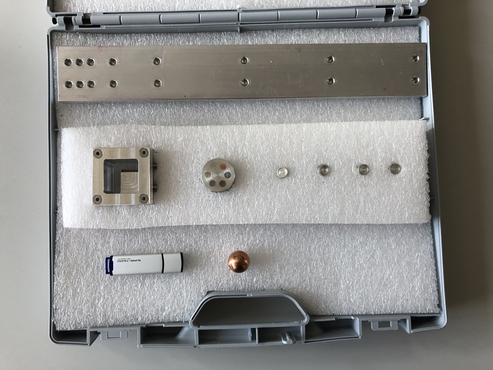

# The sample box

## Contents

Items | Description | Materials
------ | ------------------------- | -----------------------
1 | Distance frame | Aluminum
1 | Slanted edge sample | Aluminium and gadolinium
1 | Copper sphere 20mm | Copper
1 | Contrast sample | Aluminium, iron, copper, nickel, lead, titanium 
4 | Ball packings 0.5, 0.8, 1.0, and 2.0 mm| Aluminium, copper
1 | USB pen-drive 32Gb | Electronics

## Sample Weights
_Note_: The weights and volumes are calculated.

### Contrast sample
Total sample weight:  78 g

Material | Density | Volume | Weight	
---------|---------|--------|-------
Al	|2.7	|17cm3	|45.80 g
Ni	|8.9	|0.42cm3	|3.77 g
Cu	|8.96	|0.85cm3	|7.60 g
Fe	|7.874	|0.85cm3	|6.68 g
Ti	|4.54	|0.85cm3	|3.85 g
Pb	|11.35	|0.85cm3	|9.63 g

### Edge sample

Total weight: 132g

Material | Density | Volume | Weight	
---------|---------|--------|-------
Al	|2.7	|48cm3	|130 g
Gd	|7.9	|1.78cm3	|1.78 g

### Copper ball

Material | Density | Volume | Weight	
---------|---------|--------|-------
Cu	|8.96	|14.1cm3	|126 g

### Copper ball packings
Total weight: 4.4g

Material | Density | Volume | Weight	
---------|---------|--------|-------
Al	|2.7	|1.6cm3	|2.2 g
Cu	|8.96	|0.24cm3|2.15 g
